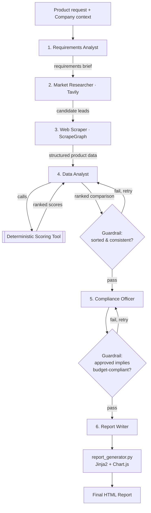

# Multi-Agent Procurement Assistant (CrewAI)

A multi-agent AI system that takes a plain-language product request and a
company's buying context, researches the live market, scrapes and verifies
real product data, **deterministically** scores and ranks candidates, runs
an independent compliance check, and produces a polished, executive-ready
HTML procurement report -- citations, methodology, and risk flags included.

Built to demonstrate how a production-shaped multi-agent system is put
together: specialized agents with narrow mandates, structured (not free-text)
hand-offs between them, code-enforced guardrails, a deterministic scoring
engine instead of LLM vibes for anything that has to be defensible, and two
interchangeable orchestration strategies (fixed sequential Crew vs.
event-driven Flow with retries).

---

## Why this isn't just "one big prompt"

A single agent asked to "research, scrape, compare, and report on products"
will skip steps under its own time pressure: skim two search results, half
verify a spec, rank from memory. This project splits that into six agents,
each with **one job and the tools to do only that job**:

| # | Agent | Job | Tool(s) |
|---|-------|-----|---------|
| 1 | Requirements Analyst | Turn a vague request + company context into concrete search queries and hard requirements | — (reasoning only) |
| 2 | Market Research Specialist | Find real, current product listings across multiple vendors | **Tavily Search** |
| 3 | Web Data Extraction Specialist | Visit each candidate URL, extract structured price/spec data | **ScrapeGraph AI** (SmartScraper) |
| 4 | Procurement Data Analyst | Score and rank candidates | **Deterministic scoring tool** (plain Python, not LLM judgment) |
| 5 | Compliance & Risk Officer | Independently re-verify budget + hard requirements, flag risk | — (reasoning only, code-checked by a guardrail) |
| 6 | Report Writer | Synthesize everything into the final structured recommendation | — (reasoning only) |

Every hand-off between agents is a validated **Pydantic schema**
(`output_pydantic`), not a paragraph of prose the next agent has to
re-parse. Two of the six tasks additionally carry a **code guardrail** that
runs after the LLM responds and forces an automatic retry if the output is
internally inconsistent (e.g. "approved: true" on a product flagged as over
budget) -- see `src/tasks.py`.

## Architecture



Two ways to run the same six agents:

- **`src/crew.py`** — fixed sequential `Crew`. Simple, predictable, the
  right default when the pipeline order is fully known upfront.
- **`src/flow.py`** — event-driven `Flow` with `@router` branch points:
  if market research turns up too few leads, it broadens the search and
  retries once *before* wasting a scraping pass on a starved candidate set;
  if too many scrapes fail, it falls back to a no-API-key scraping tool and
  retries. This is the pattern to reach for once a crew leaves the demo
  stage and starts hitting real, flaky web data.

## Advanced features

- **Deterministic, auditable scoring** (`src/tools/scoring_tool.py`) — price/spec/vendor/delivery
  are each scored 0-100 by plain Python functions, then combined with the
  company's own priority weights. Reproducible and unit-tested
  (`tests/test_scoring.py`), not left to LLM intuition.
- **Structured outputs everywhere** — every task uses `output_pydantic`
  (`src/models.py`), so CrewAI validates and auto-retries malformed JSON at
  each hand-off instead of letting bad data flow downstream.
- **Function-based guardrails** — `budget_guardrail` and
  `compliance_guardrail` in `src/tasks.py` catch internally-inconsistent
  agent output (wrong sort order, "approved" contradicting a budget
  failure) and force a corrected retry, automatically.
- **Two orchestration engines** — swap `--engine crew` / `--engine flow` at
  the CLI; same agents, different control flow (see above).
- **Tool fallbacks, not hard failures** — no `TAVILY_API_KEY`? Falls back to
  `SerperDevTool`. No `SCRAPEGRAPH_API_KEY`? Falls back to the free
  `ScrapeWebsiteTool`. The crew still runs; it degrades gracefully instead
  of crashing on a missing key.
- **Disk-backed request cache** (`src/tools/cache.py`) with a TTL, so
  repeated dev runs against the same product category don't re-spend API
  calls.
- **Company-context-driven, not hardcoded** — every agent's backstory and
  every scoring weight is generated from a single `CompanyProfile` object
  (`src/company_context.py`); point it at a different buyer and every
  downstream decision (budget checks, risk tolerance, vendor exclusions)
  updates with it.
- **Offline demo mode** (`--demo`) — renders the full HTML report from
  bundled, realistic fixture data with zero API calls, so the report design
  and scoring math are reviewable without any keys configured.
- **Designed HTML report, not a dumped table** — a "score ledger" stacked
  bar per candidate showing exactly how much each factor contributed to the
  weighted total, a radar chart comparing the top 3 candidates, a
  circular "approval stamp" for the recommendation, and a full audit trail
  (methodology, disqualification reasons, sources).
- **Dockerized** — `docker compose run procurement-assistant --demo` runs
  the whole thing with no local Python setup.

## Project layout

```
procurement_assistant/
├── main.py                     # CLI entrypoint
├── demo_data.py                 # Offline fixture data for --demo
├── src/
│   ├── config.py                 # Settings (env vars) — single source of truth
│   ├── company_context.py         # CompanyProfile schema + example buyer
│   ├── models.py                   # Pydantic contracts between agents
│   ├── agents.py                    # The 6 agent definitions
│   ├── tasks.py                      # The 6 tasks + guardrails
│   ├── crew.py                        # Sequential orchestration
│   ├── flow.py                         # Event-driven orchestration (advanced)
│   ├── report_generator.py              # Renders final ProcurementRecommendation → HTML
│   ├── templates/report_template.html    # Jinja2 + Chart.js report template
│   ├── tools/
│   │   ├── search_tools.py                # Tavily wrapper + fallback
│   │   ├── scraping_tools.py               # ScrapeGraph wrapper + fallback
│   │   ├── scoring_tool.py                  # Deterministic scoring engine + CrewAI tool wrapper
│   │   └── cache.py                          # Disk cache for tool calls
│   └── utils/
│       ├── logger.py                          # Rich console output
│       └── currency.py                         # Currency formatting
├── tests/                                        # pytest, zero network/LLM dependency
├── sample_output/                                 # Pre-generated example report
├── requirements.txt
├── .env.example
├── Dockerfile / docker-compose.yml
```

## Setup

```bash
git clone <this-repo>
cd procurement_assistant
python -m venv .venv && source .venv/bin/activate     # Windows: .venv\Scripts\activate
pip install -r requirements.txt
cp .env.example .env      # then fill in your keys
```

### Getting API keys

| Key | Where | Free tier? |
|---|---|---|
| `ANTHROPIC_API_KEY` | https://console.anthropic.com | Pay-as-you-go, no free tier |
| `TAVILY_API_KEY` | https://tavily.com | Yes, 1,000 free searches/month |
| `SCRAPEGRAPH_API_KEY` | https://scrapegraphai.com | Yes, limited free credits |

You don't need `SCRAPEGRAPH_API_KEY` to get started — omit it and the crew
automatically falls back to a free scraping tool (see **Advanced features**
above).

### Using a different LLM (Ollama, Qwen, OpenAI, Groq...)

`LLM_PROVIDER` in `.env` isn't locked to Anthropic. `.env.example` has five
ready-to-uncomment blocks: `anthropic`, `openai`, `groq`, `ollama`
(**fully local and free — no API key or signup at all**), and `dashscope`
(Alibaba's hosted Qwen API, has a free tier). To run this entirely for
free with a locally-hosted Qwen model:

```bash
# 1. Install Ollama (separate app, not a pip package): https://ollama.com
# 2. Pull a model with solid tool-calling support -- 14B+ params recommended:
ollama pull qwen2.5:14b
# 3. In .env:
LLM_PROVIDER=ollama
MANAGER_MODEL=ollama_chat/qwen2.5:14b   # note: ollama_chat/, not ollama/ --
WORKER_MODEL=ollama_chat/qwen2.5:14b    # gives far more reliable tool calling
```

You still need `TAVILY_API_KEY` either way (that's the web search agent, not
the LLM) — its free tier covers this comfortably.

Only `groq` needs an extra install: `pip install "crewai[litellm]"`. The
others (including `ollama`/`dashscope`) work with the base install — see the
comment block at the top of `requirements.txt` for exactly why (crewai 1.x
ships native/OpenAI-compatible handlers for most providers).

One honest caveat: this crew leans on strict JSON (`output_pydantic`) and
tool calling at every step. Smaller/quantized local models are noticeably
less reliable at both than Claude or GPT-4o — expect more guardrail retries,
and consider a bigger model (`qwen2.5:32b`+) if a small one struggles.

### Run it

```bash
# See the full report design instantly, no API keys needed:
python main.py --demo

# Real run:
python main.py --request "enclosed-chamber 3D printer for a robotics lab"

# Same request, event-driven engine with retry/branching logic:
python main.py --request "enclosed-chamber 3D printer for a robotics lab" --engine flow

# Run the test suite (no network/API keys needed):
pytest tests/ -v

# Docker, one command:
docker compose run procurement-assistant --demo
```

Every run writes a timestamped HTML file to `outputs/` and prints a live
ranking table to the terminal.

## Customizing the company context

Edit `DEFAULT_COMPANY` in `src/company_context.py` — or construct your own
`CompanyProfile(...)` and pass it into `ProcurementCrew` / `ProcurementFlow`
from `main.py`. Every field (budget, priority weights, hard requirements,
risk tolerance, excluded vendors) flows straight into every agent's prompt
and directly into the scoring math, so there's exactly one place to change
"who are we buying for."

## Extending this project

- **New scoring dimension** (e.g. "sustainability score"): add it to
  `ProductScoreInput`/`ScoreBreakdown` in `scoring_tool.py`/`models.py`,
  give it a weight in `PriorityWeights`, and the report's ledger/radar chart
  pick it up automatically.
- **New agent** (e.g. a "Negotiation Agent" that drafts vendor outreach
  emails for the top pick): add it in `agents.py`, a task in `tasks.py`
  with `context=[report_task]`, append it to the task list.
- **Different LLM provider**: see "Using a different LLM" above — change
  `LLM_PROVIDER` + the matching key/model strings in `.env`. Covers Claude,
  OpenAI, Groq, local Ollama (free), and hosted Qwen/DashScope out of the box.
- **Hierarchical process**: set `CREW_PROCESS=hierarchical` in `.env` to let
  a manager LLM dynamically delegate between agents instead of the fixed
  order — useful once you add agents whose ordering isn't always the same.

## Design notes / limitations

- The scoring engine is intentionally simple and transparent rather than a
  black-box ML ranker — the whole point is that a procurement manager can
  open `scoring_tool.py` and see exactly why product A outranked product B.
- Web-scraped price/spec data can be wrong or stale; the report's footer and
  the Compliance Officer's review both exist specifically to keep a human
  in the loop before a purchase order goes out.
- **`CREW_MEMORY` defaults to `false`.** CrewAI's cross-run memory pulls in
  chromadb + a local embedding model; in testing, this reliably caused a
  hard process abort (SIGABRT) at interpreter shutdown in a containerized
  environment, silently swallowing any unflushed output — a bad failure
  mode for a CLI tool to have on by default. Verify it behaves cleanly in
  your target environment before enabling it.
- **`CREWAI_DISABLE_TELEMETRY` defaults to `true`.** Two reasons: this crew
  handles a company's real budget and vendor data, so telemetry should be
  an opt-in, not a silent default; and CrewAI's OpenTelemetry span flush at
  shutdown was observed to stall when the collector endpoint is unreachable
  (e.g. restricted egress), adding real, avoidable latency to every run.
- The `crewai-tools` search/scrape wrappers will, on a *missing* optional
  SDK (`tavily-python` / `scrapegraph-py`), interactively prompt
  `Would you like to install it? [y/N]` instead of raising — which hangs
  indefinitely with no terminal attached (a server, a container, CI). The
  tool factories in `src/tools/` check the underlying SDK is importable
  *before* handing off to `crewai_tools`, so a missing dependency is always
  an immediate, clear `RuntimeError` instead. This also catches a version
  trap: `scrapegraph-py>=2.0` renamed its `Client` class and silently
  breaks the installed `crewai_tools`, which is why `requirements.txt`
  pins the `crewai-tools[scrapegraph-py]` extra rather than an unconstrained
  `pip install scrapegraph-py`.
- This is a reference implementation, not a hardened production service —
  there's no auth, rate limiting, or persistent job queue. See `src/flow.py`
  for the retry/fallback patterns you'd build on for that.
